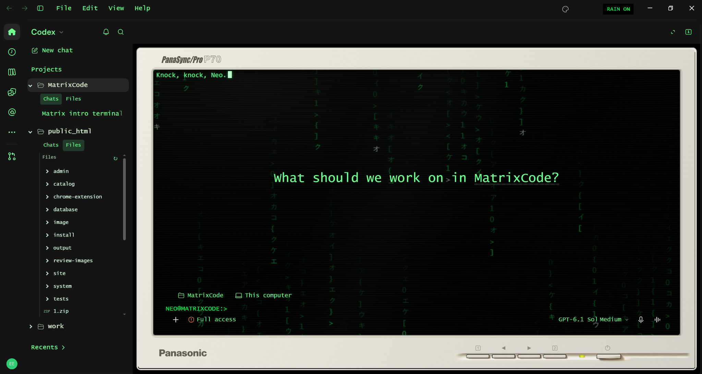
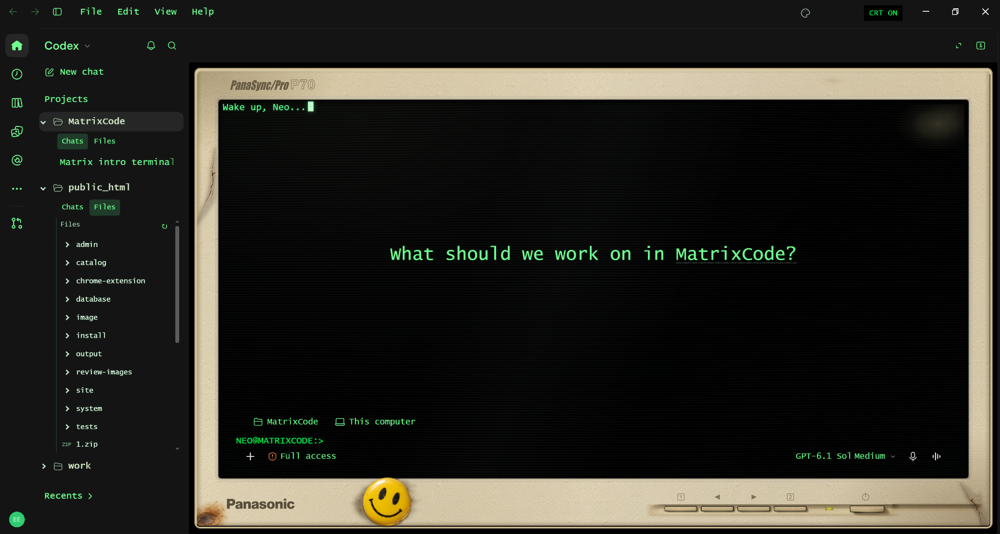
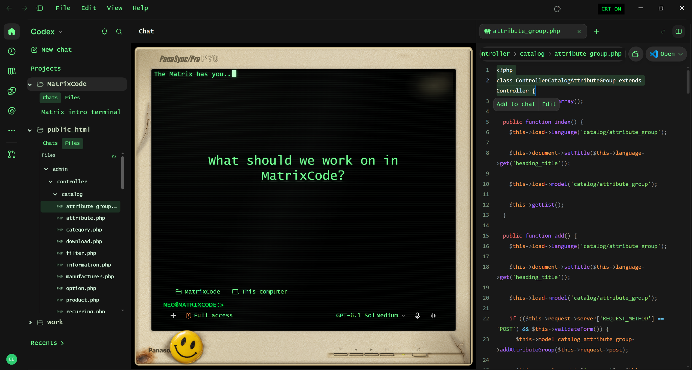
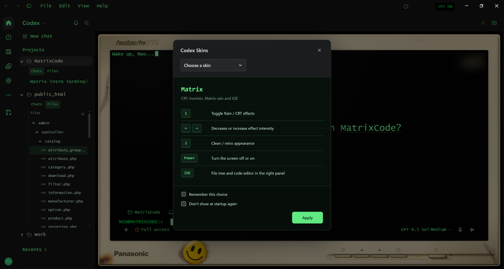

# Codex Skins

Open-source themes and productivity enhancements for **Codex Desktop on Windows**.

## Download

**[⬇ Download Codex Skins v1.0.0](https://github.com/eyupkerimoglu/codex-skins/releases/latest/download/CodexSkinsSetup.exe)**

[▶ Watch Demo](https://github.com/eyupkerimoglu/codex-skins/releases/latest/download/Codex_Skins_Demo_v1.mp4) · [Türkçe README](README_TR.md)

> **Unofficial community project.** Codex Skins is not affiliated with or endorsed by OpenAI.

---

## What is Codex Skins?

Codex Skins adds visual themes and IDE-style productivity features to Codex Desktop while keeping the original Codex workflow available.

The first release includes the **Matrix CRT** skin, a project file tree, a built-in code editor, Skin Manager and additional workflow enhancements.

## Matrix CRT

An interactive retro CRT interface inspired by the Matrix aesthetic.

### Features

- Interactive CRT-style Matrix interface
- Matrix Rain effect with intensity controls
- Two monitor appearances
- Functional monitor-style controls
- Skin Manager
- Matrix and Default Codex modes
- One-click return to the original Codex interface
- Project Chats / Files separation
- VS Code-style project file tree
- Built-in code viewer and editor
- Syntax highlighting
- Multiple file tabs
- Search, edit, save, undo and redo
- Send selected code directly to Codex chat
- Edit selected code with Codex
- Multi-language custom UI
- Windows installer and uninstaller

## Matrix Controls

| Control | Action |
|---|---|
| `1` | Toggle Matrix / Rain effects |
| `← / →` | Decrease / increase effect intensity |
| `2` | Switch monitor appearance |
| `Power` | Darken / restore the CRT screen |
| Palette icon | Open Skin Manager |

## Screenshots

### Matrix CRT

### Clean / Retro CRT

### Built-in Code Editor

### Skin Manager

## Installation

1. Install the official **Codex Desktop** app.
2. Download **CodexSkinsSetup.exe** using the download link above.
3. Run the installer.
4. Launch **Codex Skins** from the desktop or Start menu.
5. Select **Matrix** or **Default Codex** from Skin Manager.

Normal per-user installation does not require administrator access.

## Skin Manager

Skin Manager allows you to:

- switch between available skins
- return to the default Codex interface
- remember the selected skin
- hide Skin Manager on startup
- reopen Skin Manager from the palette icon

The skin system is registry/config-driven, allowing additional skins to be added in future releases.

## Languages

The custom Codex Skins interface currently supports:

- English
- Turkish
- German
- French
- Spanish
- Italian
- Portuguese
- Russian
- Simplified Chinese
- Traditional Chinese
- Japanese
- Korean

Unsupported locales fall back to English.

## Uninstall

Codex Skins can be removed using its Windows uninstall entry.

Uninstalling Codex Skins does not remove the official Codex Desktop installation.

## Requirements

- Windows
- Official Codex Desktop installation

## Roadmap

Additional skins and customization options are planned for future releases.

## Contributing

Issues, bug reports and pull requests are welcome.

## License

Licensed under the **Apache License 2.0**.

See [LICENSE](LICENSE).

---

Created by **Eyra**

GitHub: **@eyupkerimoglu**  
Telegram: **@eyrafx**
